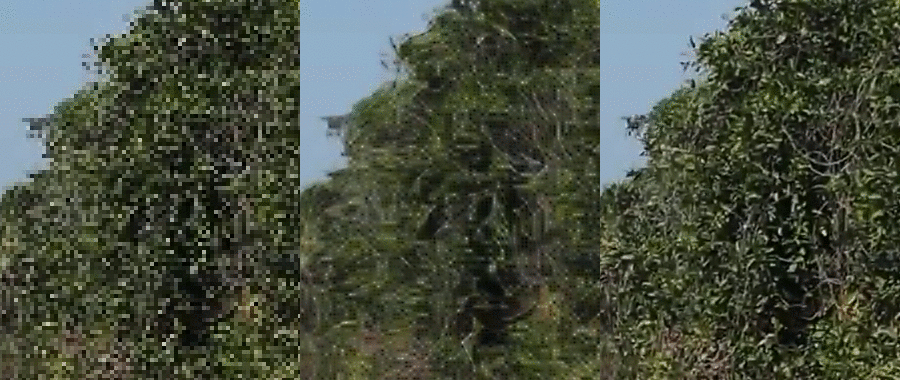

# Frame-Recurrent Video Super-Resolution

This is the official repository for the Frame-Recurrent Video Super-Resolution project by Mehdi S. M. Sajjadi, Raviteja Vemulapalli and Matthew Brown, presented at CVPR 2018.


## Results

(left: low-resolution input, middle: FRVSR output, right: high-resolution ground truth)

### More videos
<https://vimeo.com/album/5053944>

### Vid4 dataset
<https://owncloud.tuebingen.mpg.de/index.php/s/2AFqCHjHFtqezR9>

## Paper and Poster
- Paper (arXiv link): <https://arxiv.org/abs/1801.04590>
- Poster (in this repository): [poster.pdf](poster.pdf)

## Training dataset
1. Download the source file [dataset_train.txt](dataset_train.txt)
2. Install [youtube-dl](https://rg3.github.io/youtube-dl/)
3. Run `youtube-dl -civ --batch-file=dataset_train.txt`

Please note that some of the videos may be unavailable by now.

## BibTex citation
```
@inproceedings{frvsr,
  title={{Frame-Recurrent Video Super-Resolution}},
  author={Sajjadi, Mehdi S. M. and Vemulapalli, Raviteja and Brown, Matthew},
  booktitle = {{The IEEE Conference on Computer Vision and Pattern Recognition (CVPR)}},
  month = {June},
  year={2018}
}
```

For any questions, comments or help to get it to run, please don't hesitate to mail us: <msajjadi@tue.mpg.de>
